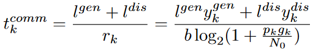
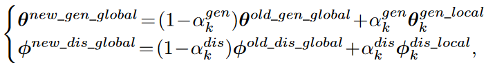

# AsyncFedGAN
## An Efficient and Staleness-aware Asynchronous Federated Learning Framework for Generative Adversarial Networks

Training GANs under federated settings is not straight-forward since there are two models, i.e., generator and discriminator, influencing each other. How to efficiently train the two interactive models is still unclear. In this project, we proposed a novel asynchronous FL framework for GAN, i.e., AsyncFedGAN, that combines asynchronous FL with
GAN to efficiently and distributively train the generator and discriminator. AsyncFedGAN defines an efficient way to train two interactive models in GAN, resolves the straggler problem in synchronous FL, mitigates model staleness in asynchronous FL, and can potentially reduce the energy consumption of clients. 

There can be two possible ways of training a GAN, namely (1) Separated model training in two global rounds, where each client first trains and uploads its local discriminator in a global round, and then train and upload its local generator in the next global round and (2) Integrated model training, where each client trains and uploads its local generator and discriminator in each global round. In this work we selected the Integrated model training, because Separated model training can potentially lead to higher computing and communications costs than integrated model training.

We formulate latency models to estimate the delay of a client in training and uploading its local models in terms of computing and communication latencies.

1. The computing latency of training both models at each client is given by: 

2. The communication latency assuming that clients communicate with the PS via wireless, and the sizes of the generator and discriminator models are $l^{gen}$ and $l^{dis}$, is given by

Since we are using asynchronous FL, the FL server updates the global model immediately it recieves a local model from a client and the following equations are used to update the global generator and discriminator models.

We apply three staleness functions to measure the freshness of the global model that client $k$ is training for and is a function of client $k’s$ latency $t_k$, as given below:

Training the generator and discriminator models consume a huge amount of computing resources for a client. To save the computing resource, energy of clients and accelerate the training process, we introduce a constraint of training generator/discriminator model if the difference in terms of L2
norm between the uploaded local model and the new global model is no larger than a predefined threshold, i.e.,
